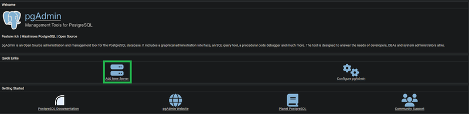
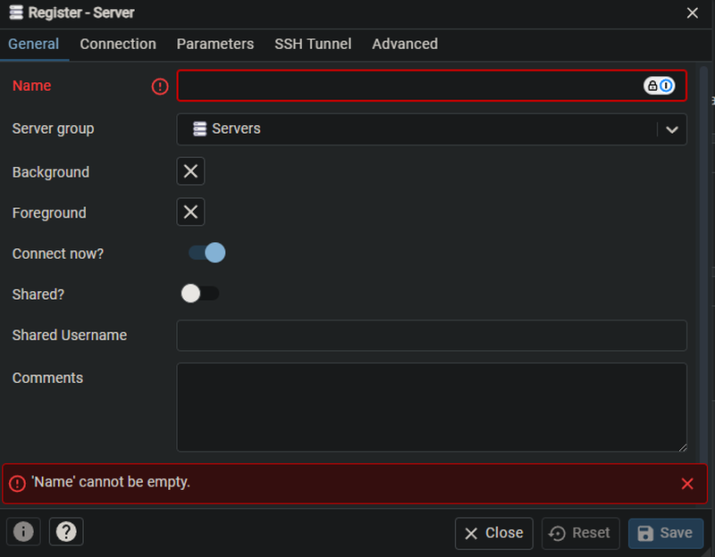
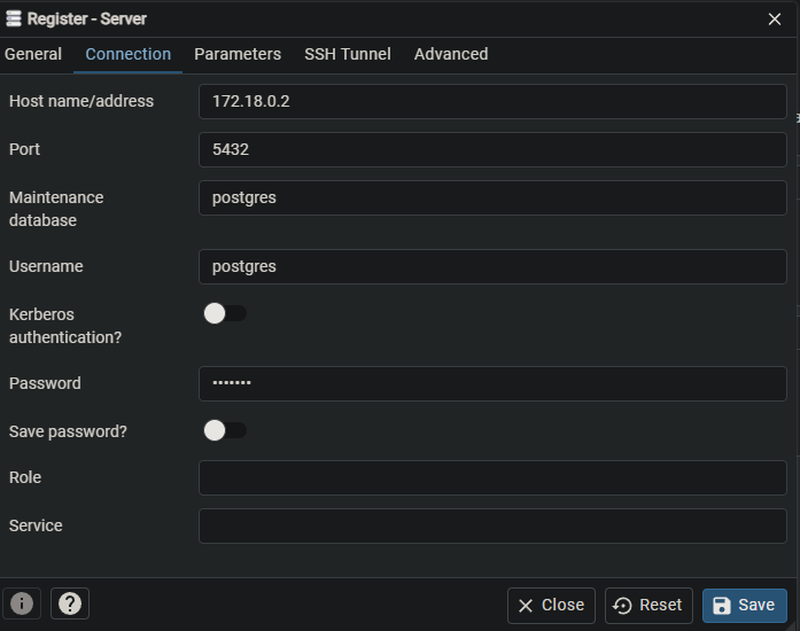
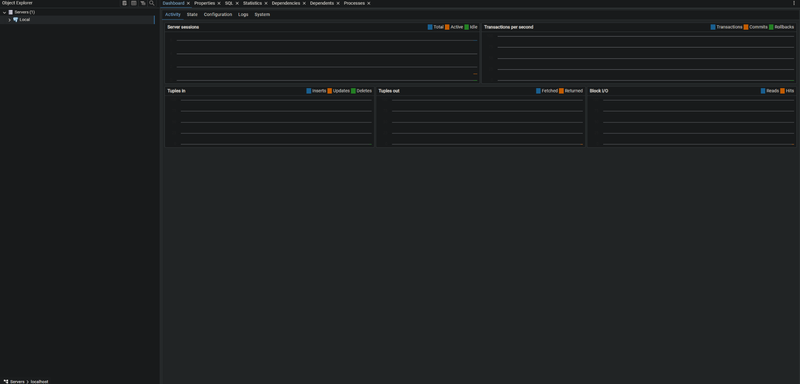

# Setting Up PostgreSQL and pgAdmin with Docker

This guide will walk you through setting up PostgreSQL and pgAdmin using Docker Compose, and then configuring pgAdmin to connect to your PostgreSQL instance.

## Step 1: Start the Containers

First, ensure your Docker Compose file is properly configured, then start the PostgreSQL and pgAdmin containers:

```bash
docker-compose up -d
```

## Step 2: Access pgAdmin

Open your web browser and go to the pgAdmin interface:

```
http://localhost:8080/
```

## Step 3: Get the PostgreSQL Container IP Address

To configure pgAdmin, you'll need the IP address of your PostgreSQL container. Retrieve it by running the following command in your terminal, replacing \`<containername>\` with the actual name of your PostgreSQL container:

```bash
docker inspect -f '{{range .NetworkSettings.Networks}}{{.IPAddress}}{{end}}' <containername>
```

Make a note of the IP address, as you'll need it to add the server in pgAdmin.

## Step 4: Log In to pgAdmin

Log in to the pgAdmin interface using your credentials.


## Step 5: Add a New Server

Once logged in, you'll need to add a new server in pgAdmin:

### 5.1 Click "Add New Server"

Click on the "Add New Server" button to start the server registration process.



### 5.2 Enter a Server Name

In the "General" tab, enter a name for your server. This can be anything you choose.



### 5.3 Enter Connection Details

Switch to the "Connection" tab and enter the following details:

- **Host name/address**: Enter the IP address of your PostgreSQL container that you retrieved earlier.
- **Username**: Change the username from the default \`postgres\` if needed.
- **Password**: Enter the password that you set in the \`docker-compose.yml\` file.

Then, click "Save."



## Step 6: View the Server Overview

After saving the connection, you should see an overview of the PostgreSQL server you just added.




## Troubleshooting

If you encounter issues while setting up PostgreSQL and pgAdmin, here are some troubleshooting steps you can follow:

### 1. Verify Containers Are Running

Ensure that both the PostgreSQL and pgAdmin containers are running. You can check this by executing the following command:

```bash
docker ps
```

You should see at least two containers listed—one for PostgreSQL and another for pgAdmin.

### 2. Check Container Logs for Errors

If you encounter any errors, you can inspect the logs for more details. Use the following command, replacing `<containername>` with the name of your container:

```bash
docker logs <containername>
```

This command will display the logs, which may provide clues about what went wrong.


### 4. Connecting Directly to PostgreSQL

If you are unable to connect through pgAdmin or are experiencing issues, you can connect directly to PostgreSQL using the following command:

```
docker exec -it <containername> psql -U postgres
```

This command will open a `psql` session where you can execute SQL commands directly, which can help in diagnosing issues.

```
psql (16.4)
Type "help" for help.

postgres=#
```

If you use the command \du then you should se your users their roles and 

```
psql (16.4)
Type "help" for help.

postgres=# /du
```

Like this

```
                             List of roles
 Role name |                         Attributes                         
-----------+------------------------------------------------------------
 postgres  | Superuser, Create role, Create DB, Replication, Bypass RLS
```


There was an issue were the password of my user was not sha-256 encrypted.
Then if you reassign your password it works. Here is how you do that

If you use the command \du then you should se your users their roles and 

```
psql (16.4)
Type "help" for help.

postgres=# ALTER USER postgres PASSWORD 'newpassword';
```

Like this

```
                             List of roles
 Role name |                         Attributes                         
-----------+------------------------------------------------------------
 postgres  | Superuser, Create role, Create DB, Replication, Bypass RLS
```


This will list all the roles in the database, allowing you to confirm the correct username.